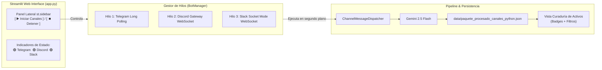
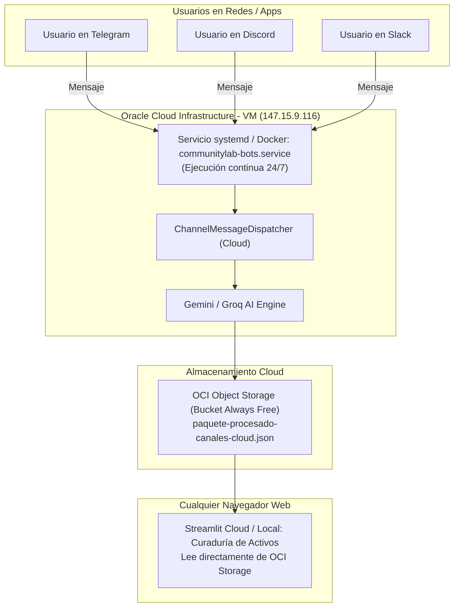
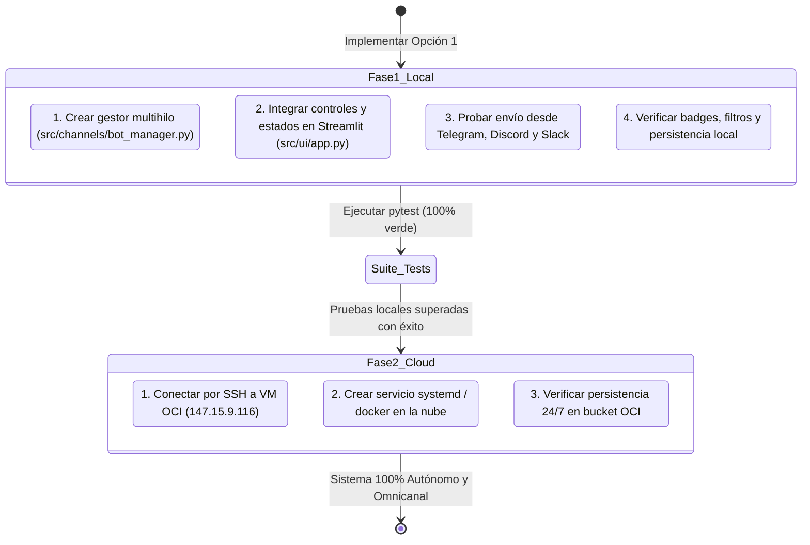

# 🚀 Arquitectura e Implementación Multicanal: Telegram, Discord y Slack en CommunityLab

**Proyecto:** CommunityLab - Hackathon ONE G10 (Oracle & Alura / No Country)  
**Autor:** Max Ferrer Cabanillas Salas (`mcabanillassalas`) - Backend & Pipeline Developer  
**Fecha:** 24 de septiembre de 2026  
**Rama:** `feat/backend-pipeline-max`  
**Estado:** Documento de Diseño y Hoja de Ruta de Implementación  

---

## 1. Contexto y Desafío Técnico

Actualmente, el sistema cuenta con los 3 bots interactivos completamente programados y probados:
* **Telegram:** `src/channels/telegram_bot.py` (Long Polling con `python-telegram-bot`).
* **Discord:** `src/channels/discord_bot.py` (WebSocket Gateway con `discord.py`).
* **Slack:** `src/channels/slack_bot.py` (Socket Mode WebSocket con `slack_bolt`).

Sin embargo, para utilizarlos en pruebas manuales se requería ejecutar scripts de consola independientes por cada canal:
```bash
python scripts/run_bots.py --channel telegram
python scripts/run_bots.py --channel discord
python scripts/run_bots.py --channel slack
```

### 🎯 Objetivo de la Nueva Implementación
Permitir que el usuario o evaluador interactúe por cualquiera de las 3 plataformas (Telegram, Discord o Slack) **sin tener que abrir ninguna terminal extra ni ejecutar scripts por separado**. El sistema debe capturar el mensaje en segundo plano, procesarlo con la IA (Gemini 2.5 Flash / Groq) y registrarlo automáticamente en el archivo de **Curaduría de Activos** de Streamlit.

---

## 2. Las 3 Formas de Implementación

A continuación se analizan en detalle las 3 alternativas arquitectónicas para resolver este requerimiento:

| Criterio | Opción 1: Servicio Integrado en Streamlit | Opción 2: Servicio 24/7 en OCI Cloud VM | Opción 3: Lanzador CLI / Script .bat Unificado |
| :--- | :--- | :--- | :--- |
| **Entorno de ejecución** | Local (Dentro del proceso de Streamlit) | Cloud (VM Ubuntu Oracle Cloud: `147.15.9.116`) | Local (Subproceso Windows independiente) |
| **Complejidad de uso** | **Cero consolas:** Se inicia con 1 clic en la UI | **Cero ejecución local:** Corre solo en la nube | Requiere ejecutar 1 archivo `.bat` o comando |
| **Disponibilidad** | Mientras Streamlit esté abierto en local | **24/7 ininterrumpido** (incluso con la PC apagada) | Mientras la consola/proceso local esté abierto |
| **Persistencia** | `data/paquete_procesado_canales_python.json` | OCI Object Storage bucket directo | `data/paquete_procesado_canales_python.json` |
| **Ideal para** | **Desarrollo, testing local ágil y demos** | **Producción real y despliegue final** | Alternativa de contingencia |

---

### 🔹 Opción 1: Servicio de Bots Integrado en Streamlit (Recomendada para Desarrollo Local)
*(Fase 1 de la Hoja de Ruta)*

En esta modalidad, la propia aplicación web de Streamlit (`src/ui/app.py`) asume el rol de supervisor de los bots mediante un módulo gestor (`BotManager`):



#### Ventajas Clave:
1. **Comodidad Total:** Solo ejecutas `streamlit run src/ui/app.py` como de costumbre.
2. **Interruptor en la Barra Lateral:** Un control en `st.sidebar` permite encender o apagar la escucha de los 3 canales con un solo clic.
3. **Monitoreo Visual:** Indicadores lumínicos (🟢 En línea / 🔴 Desconectado) que confirman que cada bot está autenticado y listo para recibir mensajes.
4. **Flujo Cerrado:** Escribes en Telegram, abres la pestaña "Curaduría de Activos" y el activo generado por IA ya está disponible con su badge `[✈️ Telegram]`.

---

### 🔹 Opción 2: Servicio 24/7 en la Nube (VM de Oracle Cloud - OCI)
*(Fase 2 de la Hoja de Ruta)*

En esta modalidad, los bots se ejecutan como un servicio permanente del sistema operativo (`systemd daemon` o contenedor Docker con reinicio automático) dentro de la máquina virtual de Oracle Cloud (`147.15.9.116`):



#### Ventajas Clave:
1. **Independencia de la Computadora Local:** Puedes cerrar tu laptop o apagar tu PC; el bot sigue respondiendo en Telegram, Discord y Slack a cualquier hora.
2. **Cero Consumo de Recursos Locales:** Tu máquina no consume memoria ni ancho de banda manteniendo las conexiones abiertas.
3. **Persistencia Centralizada:** Todos los mensajes se guardan directamente en el bucket oficial de Oracle Cloud Infrastructure (OCI).

---

### 🔹 Opción 3: Lanzador CLI / Script .bat Unificado en Background
*(Alternativa de contingencia)*

Consiste en un script supervisor en Python o un archivo por lotes de Windows (`scripts/iniciar_todos_los_bots.bat`) que lanza los tres bots en subprocesos concurrentes mediante `multiprocessing` o `subprocess.Popen` sin bloquear la consola.

* Se invoca mediante:
  ```bash
  python scripts/run_bots.py --channel all
  ```
* Inicia los 3 listeners en un único comando y se detiene limpiamente con `Ctrl + C`.

---

## 3. Hoja de Ruta y Plan de Trabajo Acordado

Siguiendo la estrategia definida, la implementación se dividirá en dos etapas secuenciales:



---

## 4. Especificación Técnica de la Fase 1 (Opción 1: Streamlit Bot Manager)

### 4.1 Componentes a Desarrollar:
1. **`src/channels/bot_manager.py` (Nuevo):**
   * Clase `OmnichannelBotManager` con patrón Singleton o almacenado en `st.session_state`.
   * Métodos: `start_all()`, `stop_all()`, `get_status()`.
   * Gestión de hilos de ejecución `threading.Thread(daemon=True)` para aislar:
     * Hilo Telegram: `run_polling()`
     * Hilo Discord: `start_bot()` (manejando su event loop asyncio)
     * Hilo Slack: `start_socket_mode()`
2. **`src/ui/app.py` (Actualización):**
   * Incorporar en la barra lateral (`st.sidebar`) una sección dedicada:
     * Botón dinámico: **`[ ▶️ Iniciar Todos los Canales ]`** / **`[ ⏹️ Detener Canales ]`**.
     * Tarjetas de estado con luces indicadoras:
       * `🟢 Telegram Bot (@G10_Latam_06_bot): Conectado`
       * `🟢 Discord Bot (G10-LATAM-06): Conectado`
       * `🟢 Slack Bot (G10-LATAM-06): Conectado`
3. **Flujo de Usuario Esperado:**
   1. Abres la app: `streamlit run src/ui/app.py`.
   2. Haces clic en **`[ ▶️ Iniciar Todos los Canales ]`** en la barra lateral.
   3. Envías un mensaje desde tu app de Telegram, Discord o Slack.
   4. En Streamlit, navegas a **"Curaduría de Activos"**.
   5. ¡Listo! El mensaje aparece de inmediato con su respectivo badge (`[✈️ Telegram]`, `[🎮 Discord]`, `[💬 Slack]`) y el post generado por la IA para su revisión.

---

## 5. Especificación Técnica de la Fase 2 (Opción 2: OCI Cloud VM 24/7)

Una vez que la Fase 1 esté validada al 100% en local:
1. **Configuración del Servicio en la VM (`/etc/systemd/system/communitylab-bots.service`):**
   ```ini
   [Unit]
   Description=CommunityLab Omnichannel Bots Service (Telegram, Discord, Slack)
   After=network.target

   [Service]
   Type=simple
   User=ubuntu
   WorkingDirectory=/home/ubuntu/G10-LATAM-equipo6-CommunityLab
   ExecStart=/home/ubuntu/G10-LATAM-equipo6-CommunityLab/env/bin/python scripts/run_bots.py --channel all
   Restart=always
   RestartSec=10
   EnvironmentFile=/home/ubuntu/G10-LATAM-equipo6-CommunityLab/.env

   [Install]
   WantedBy=multi-user.target
   ```
2. **Persistencia Automática:**
   * En entorno `ENTORNO_DEPLOY=PRODUCCION`, el `ChannelMessageDispatcher` exportará periódicamente cada interacción hacia OCI Object Storage.
   * La interfaz de Streamlit podrá consultar tanto los lotes históricos como el lote dinámico en la nube en tiempo real.

---

## 6. Criterios de Aceptación para la Fase 1

- [x] Un solo clic en Streamlit inicia los 3 bots en segundo plano sin bloquear la navegación de la app.
- [x] Un mensaje enviado en Telegram (`@G10_Latam_06_bot`) recibe respuesta automática de la IA y se guarda en `data/paquete_procesado_canales_python.json`.
- [x] Un mensaje enviado en Discord (`#general`) recibe un Embed estructurado y se guarda en el mismo archivo.
- [x] Una mención en Slack (`@G10-LATAM-06`) recibe respuesta en el hilo y se guarda en el mismo archivo.
- [x] La vista "Curaduría de Activos" permite filtrar y mostrar cada interacción con su badge de canal correspondiente.
- [x] La suite de pruebas de `pytest` permanece 100% en verde (69/69 tests pasando exitosamente).
