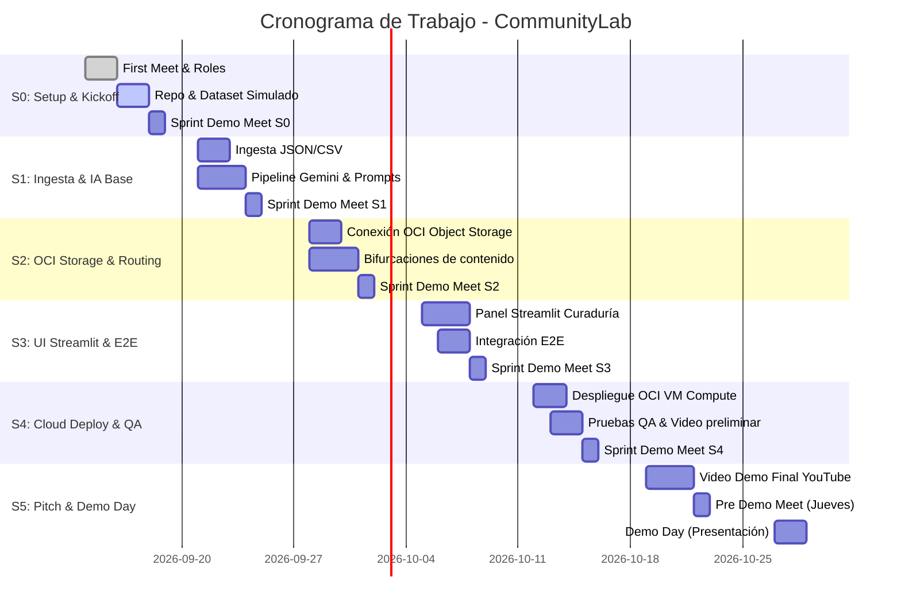

# 🗺️ Roadmap y Plan Maestro: CommunityLab (Equipo 6)
**Hackathon ONE G10 — Oracle Next Education & Alura / No Country**

---

## 🎯 Objetivo del Proyecto
Desarrollar un MVP de un **Motor Inteligente de Transformación y Distribución para Comunidades Digitales**:
1. Ingesta de interacciones de comunidad (JSON, CSV, Webhook).
2. Análisis de sentimiento, extracción de temas y categorización mediante LLMs (Google Gemini).
3. Generación de copys optimizados multicanal (LinkedIn, Twitter/X, Newsletters, Tips/FAQs).
4. Persistencia obligatoria de activos en **Oracle Cloud Infrastructure (OCI) Object Storage (Always Free)**.
5. Panel de visualización y curaduría de publicaciones en **Streamlit**.
6. Despliegue en máquina virtual Linux en **OCI Compute Always Free** (diferencial).

---

## 👥 Células de Trabajo y Roles (9 Integrantes)

Para optimizar la colaboración y garantizar aprendizaje transversal, el equipo se divide en 3 células clave:

### 🧠 Célula 1: IA, Prompts & Orquestación
* **Miembros sugeridos:** Max Ferrer, Edwin Enriquez, Juan Luis Mansilla.
* **Responsabilidades:**
  * Diseño de *system prompts* con *few-shot learning* para distintos canales y tonos.
  * Extracción estructurada (Pydantic / Structured Outputs) de métricas de sentimiento y temas clave.
  * Lógica de bifurcación condicional (ej.: sentimiento muy positivo $\rightarrow$ caso de éxito; duda recurrente $\rightarrow$ FAQ/Tip).
  * Pipeline de ejecución en Python (LangChain/LangGraph o scripts modulares).

### ☁️ Célula 2: Cloud OCI, Infraestructura & Backend
* **Miembros sugeridos:** César Cely (PM & Cloud), José Medina, Raúl Gallardo.
* **Responsabilidades:**
  * Configuración de Bucket en **OCI Object Storage** (Always Free) y gestión de API Keys/tenancy.
  * Módulo en Python usando `oci-python-sdk` para carga y descarga de paquetes JSON/activos.
  * Configuración de la VM en **OCI Compute (Linux Ubuntu/Oracle Linux Always Free)** con Docker / Systemd.
  * Manejo seguro de variables de entorno (`.env`, `.env.example`).

### 💻 Célula 3: Frontend (Streamlit), Datos & QA
* **Miembros sugeridos:** Edwin Enriquez (Especialista QA), Carol Arancay, Víctor Araya, Rodrigo Ramírez.
* **Responsabilidades:**
  * Creación y enriquecimiento de datasets de prueba (`data/interacciones_ejemplo.json` y `.csv`).
  * Desarrollo del panel en **Streamlit** (dashboard de salud de comunidad + panel de aprobación/edición de copys).
  * Pruebas funcionales, automatización de pruebas (Selenium / Pytest) y control de calidad.
  * Documentación de flujos de usuario y guías de uso.

---

## 📅 Cronograma Detallado Sprint a Sprint (Semanas 0 a 5)

---

### Semana 0: Kickoff, Repositorio y Arquitectura (En curso)
* **Objetivo:** Definir reglas de juego, estructura del código, dataset inicial y validar que todos tengan accesos.
* **Entregables:**
  - [x] Repositorio oficial conectado y clonado.
  - [x] Acta de la 1ª reunión (`PM_Files/acta-primera-reunion_14092026.md`).
  - [ ] Estructura base de carpetas creada (`src/`, `data/`, `config/`).
  - [ ] Archivo `data/interacciones_ejemplo.json` con 15 casos variados (testimonios, dudas técnicas, felicitaciones).
  - [ ] **Sprint Demo Meet S0 (Jueves)**.

---

### Semana 1: Ingesta de Datos & Motor de LLM (Gemini)
* **Objetivo:** Lograr que un lote de mensajes pase por Gemini y devuelva el JSON estructurado obligatorio.
* **Lunes:** *Sprint Planning Meet*. Asignación formal de tareas.
* **Desarrollo:**
  - Script de ingesta y validación de esquema con Pydantic.
  - Integración con SDK de Gemini (`google-genai`).
  - Prompt engineering: análisis de sentimiento, extracción de temas y generación de copys (LinkedIn + Newsletter/FAQ).
* **Jueves:** *Sprint Demo Meet S1*. Mostrar la ejecución del script por terminal/notebook con salida JSON formal.
* **Fin de semana:** Subir entregables de avance a No Country.

---

### Semana 2: Persistencia en OCI Object Storage & Lógica Condicional
* **Objetivo:** Guardar los activos procesados directamente en la nube de Oracle (Always Free) y filtrar por condiciones.
* **Lunes:** *Sprint Planning Meet*.
* **Desarrollo:**
  - Configuración del Bucket en OCI Object Storage.
  - Creación del cliente OCI en Python (`src/cloud_oci/storage_client.py`).
  - Enrutamiento condicional: Mensaje positivo $\rightarrow$ Post LinkedIn / Newsletter; Pregunta $\rightarrow$ Tip / FAQ.
  - Guardado del paquete de marketing en formato `activos/{fecha}/paquete-distribucion.json`.
* **Jueves:** *Sprint Demo Meet S2*. Demostración de subida automática al bucket de OCI y verificación de URLs.
* **Fin de semana:** Subir entregables a No Country.

---

### Semana 3: Panel de Curaduría en Streamlit & Flujo End-to-End
* **Objetivo:** Dotar a la solución de una interfaz gráfica que permita al usuario humano revisar, editar y aprobar publicaciones.
* **Lunes:** *Sprint Planning Meet*.
* **Desarrollo:**
  - Interfaz web con **Streamlit**:
    - Vista 1: Métricas de salud de comunidad (gráficos de sentimiento y temas más hablados).
    - Vista 2: Bandeja de copys generados (editor de texto, botón "Aprobar", "Rechazar" y "Regenerar").
    - Vista 3: Histórico de paquetes archivados en OCI.
  - Conexión del backend con la interfaz gráfica.
* **Jueves:** *Sprint Demo Meet S3*. Recorrido interactivo completo desde la carga de datos hasta la aprobación en pantalla.
* **Fin de semana:** Subir entregables a No Country.

---

### Semana 4: Despliegue en VM OCI Compute, QA & Grabación Preliminar
* **Objetivo:** Desplegar el sistema en la nube de Oracle de forma autónoma y estabilizar la aplicación.
* **Lunes:** *Sprint Planning Meet*.
* **Desarrollo:**
  - Creación de Compute Instance Linux (Always Free) en OCI.
  - Despliegue con Docker / Docker Compose (Streamlit + Backend).
  - Pruebas exhaustivas por parte del equipo QA (casos extremos, errores en API, etc.).
  - Guión del video demo y primer ensayo de grabación.
* **Jueves:** *Sprint Demo Meet S4*. Demostración de la aplicación corriendo en la IP pública de OCI.
* **Fin de semana:** Subir entregables a No Country.

---

### Semana 5: Pre-Demo, Video Demo Final y Demo Day
* **Objetivo:** Presentación del proyecto ante la comunidad evaluadora y cierre formal.
* **Lunes:** *Sprint Planning Meet* de cierre. Apertura de feedback entre compañeros en la plataforma.
* **Tareas críticas:**
  - [ ] Grabación y edición del **Video Demo de YouTube** (máximo 10 minutos, mostrando problema, solución, demo técnica y stack OCI/Gemini).
  - [ ] Pulido final del `README.md` (diagrama de arquitectura, capturas de pantalla, badges, pasos de instalación).
  - [ ] **Pre Demo Meet (Jueves):** Ensayo general con mentores.
  - [ ] **Subir entregables finales** (Cierre domingo 23:59 pm).
  - [ ] **Demo Day (Martes/Jueves):** Presentación en vivo y pitch del equipo.
