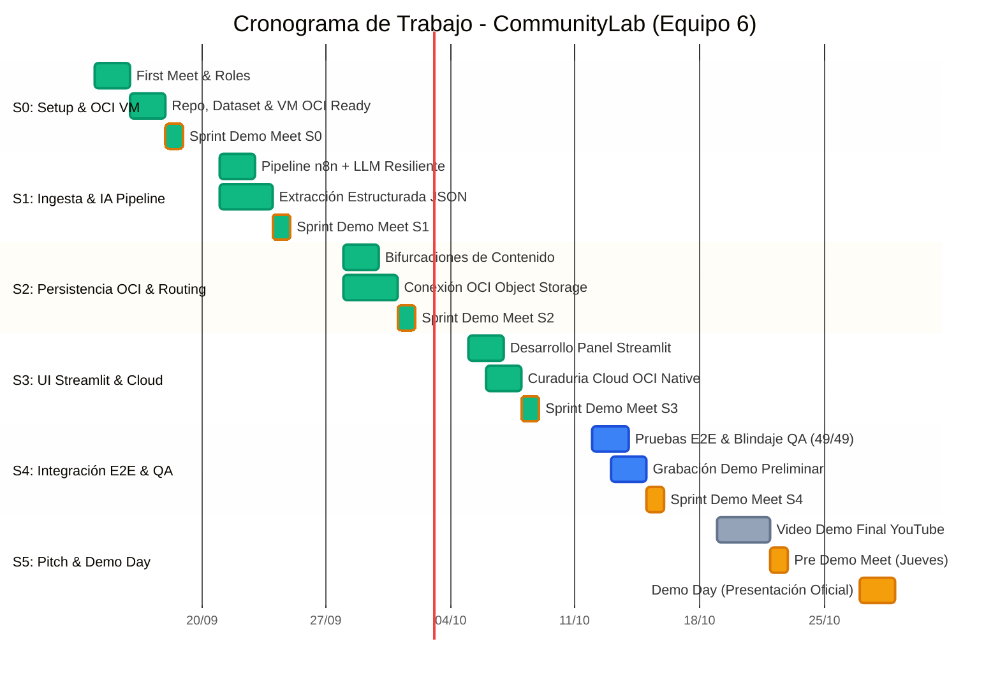

# 🗺️ Roadmap y Plan Maestro: CommunityLab (Equipo 6)
**Hackathon ONE G10 — Oracle Next Education & Alura / No Country**

---

## 🎯 Objetivo del Proyecto
Desarrollar un MVP de un **Motor Inteligente de Transformación y Distribución para Comunidades Digitales**:
1. Ingesta de interacciones de comunidad (JSON, CSV, Webhook).
2. Análisis de sentimiento, extracción de temas y categorización mediante LLMs (Google Gemini).
3. Generación de copys optimizados multicanal (LinkedIn, Twitter/X, Newsletters, Tips/FAQs).
4. Persistencia obligatoria de activos en **Oracle Cloud Infrastructure (OCI) Object Storage (Always Free)**.
5. Panel de visualización y curaduría de publicaciones en **Streamlit**.
6. Despliegue en máquina virtual Linux en **OCI Compute Always Free** (diferencial).

---

## 👥 Células de Trabajo y Roles (9 Integrantes)

Para optimizar la colaboración y garantizar aprendizaje transversal, el equipo se divide en 3 células clave:

### 🧠 Célula 1: IA, Prompts & Orquestación (n8n & Gemini)
* **Miembros sugeridos:** Max Ferrer, Edwin Enriquez, Juan Luis Mansilla, José Medina.
* **Responsabilidades:**
  * Diseño de *system prompts* con *few-shot learning* para distintos canales y tonos.
  * Extracción estructurada de métricas de sentimiento y temas clave.
  * Implementación y modelado de flujos en **n8n** (nodos de webhook, Gemini AI, bifurcación switch y exportación JSON a `n8n/workflows/`).
  * Integración híbrida con scripts de Python auxiliares si son requeridos.

### ☁️ Célula 2: Cloud OCI, Infraestructura & Backend
* **Miembros sugeridos:** César Cely (PM & Cloud), José Medina (Admin VM), Raúl Gallardo.
* **Responsabilidades:**
  * Administración y mantenimiento de la VM Linux Always Free en **OCI Compute** (`147.15.9.116`), con Docker y n8n activo.
  * Configuración de Bucket en **OCI Object Storage** (Always Free) y credenciales de acceso.
  * Integración de n8n / Python con OCI Object Storage para persistencia de activos de marketing.
  * Manejo seguro de variables de entorno (`.env`, `.env.example`).

### 💻 Célula 3: Frontend (Streamlit), Datos & QA
* **Miembros sugeridos:** Edwin Enriquez (Especialista QA), Carol Arancay, Víctor Araya, Rodrigo Ramírez.
* **Responsabilidades:**
  * Creación y enriquecimiento de datasets de prueba (`data/interacciones_ejemplo.json` y `.csv`).
  * Desarrollo del panel en **Streamlit** (dashboard de salud de comunidad + panel de aprobación/edición de copys).
  * Pruebas funcionales, automatización de pruebas (Selenium / Pytest) y control de calidad.
  * Documentación de flujos de usuario y guías de uso.

---

## 📅 Cronograma Detallado Sprint a Sprint (Semanas 0 a 5)

> 🟢 **Verde (`done`):** Tareas completadas con éxito.  
> 🔵 **Azul (`active`):** Tareas actualmente en desarrollo activo.  
> 🟠 **Ámbar / Naranja (`crit`):** Hitos críticos y Sprint Demo Meets obligatorios.  
> ⚪ **Gris:** Tareas programadas pendientes para los próximos sprints.

---

### Semana 0: Kickoff, Repositorio, Dataset y VM OCI (Completada con éxito)
* **Objetivo:** Definir reglas de juego, estructura del código, dataset inicial y dejar la infraestructura cloud base operando.
* **Entregables logrados:**
  - [x] Repositorio oficial conectado y clonado.
  - [x] Acta de la 1ª reunión (`PM_Files/acta-primera-reunion_14092026.md`).
  - [x] Estructura base de carpetas creada (`src/`, `data/`, `n8n/`, `PM_Files/`).
  - [x] Archivo `data/interacciones_ejemplo.json` con 15 casos variados (testimonios, dudas técnicas, felicitaciones).
  - [x] **Hito adelantado:** Despliegue de VM Ubuntu Always Free en **OCI Compute** (`147.15.9.116`) con Docker Compose y n8n productivo configurado con volumen persistente.
  - [x] Configuración de variables de entorno seguras (`.env.example` con Gemini, Groq, n8n y OCI).
  - [x] **Sprint Demo Meet S0**.

---

### Semana 1: Ingesta de Datos & Pipeline de LLM (Completada con éxito 🎉)
* **Objetivo:** Ingerir las interacciones de la comunidad y procesarlas a través del LLM devolviendo el JSON estructurado obligatorio.
* **Lunes:** *Sprint Planning Meet*. Asignación formal de tareas.
* **Entregables logrados:**
  - [x] Ingesta y parseo del lote de 15 mensajes en el contenedor de n8n montado desde `./data/`.
  - [x] Conexión con LLM (Gemini / Groq) mediante `Basic LLM Chain`.
  - [x] Implementación de patrón tolerante a fallos y *Rate Limits* (nodo `Loop Over Items` + `Wait` de 10s).
  - [x] Estandarización del prompt del sistema para extracción estricta: `sentimiento`, `tipo_contenido`, `temas_clave`, `post_linkedin` y `tip_tecnico_faq` ([prompt_templates.json](file:///home/cesar-cely/Proyectos/G10-LATAM-equipo6-CommunityLab/src/ai_engine/prompt_templates.json)).
  - [x] Salida de activos formateada y validada en JSON estricto.
  - [x] Script Python complementario con Pydantic en `src/ai_engine/` para validación programática (`schemas.py` y `validator.py`).
* **Jueves:** *Sprint Demo Meet S1*. Demostración en vivo del pipeline en n8n procesando los 15 casos con salida JSON formal.
* **Fin de semana:** Subir entregables de avance a No Country.

---

### Semana 2: Enrutamiento Condicional & Persistencia en OCI Object Storage (Completada con éxito 🎉)
* **Objetivo:** Bifurcar los contenidos clasificados y guardar los paquetes de marketing directamente en la nube de Oracle (Always Free).
* **Lunes:** *Sprint Planning Meet*.
* **Entregables logrados:**
  - [x] Configuración del Bucket en **OCI Object Storage** y credenciales API / Customer Secret Key (S3-compatible).
  - [x] Enrutamiento condicional en n8n con nodo `Switch` (`n8n/workflows/ingestion_groq_subflow.json`):
    - Rama A: Logros/Contrataciones $\rightarrow$ Copys optimizados para LinkedIn y Newsletter.
    - Rama B: Dudas técnicas $\rightarrow$ Formato FAQ / Tip de soporte.
    - Rama C: Feedback general $\rightarrow$ Métricas para el Community Manager.
    - Rama D: Proyectos / Showcase de la comunidad.
  - [x] Subida automatizada de activos a OCI Object Storage (`activos/{fecha}/paquete-distribucion.json`) desde n8n o cliente Python (`src/cloud_oci/storage_client.py`).
  - [x] Verificación de lectura de URLs firmadas / objetos almacenados.
* **Jueves:** *Sprint Demo Meet S2*. Demostración de subida automática al bucket de OCI y verificación de URLs de los paquetes generados.
* **Fin de semana:** Subir entregables a No Country.

---

### Semana 3: Panel de Curaduría en Streamlit & Despliegue en VM OCI (Completada con éxito 🎉)
* **Objetivo:** Dotar a la solución de una interfaz gráfica moderna (desplegada en la VM de OCI) para que los Community Managers revisen, editen y aprueben copys, con arquitectura cloud-native contra OCI Object Storage.
* **Lunes:** *Sprint Planning Meet*.
* **Entregables logrados:**
  - [x] Interfaz web con **Streamlit** en `src/ui/app.py`:
    - Vista 1: Bandeja de curaduría cloud-first con estados dinámicos (`🟢 APROBADO`, `🔴 DESCARTADO`, `🔵 LEÍDO` para FAQs y Feedback) persistidos en `curaduria/curaduria_aprobados.json` en OCI.
    - Vista 2: Orquestador interactivo dual (Motor 1 n8n vía Webhook HTTP y Motor 2 Pipeline Python Nativo con Gemini 2.5).
    - Vista 3: Explorador y gestor de activos archivados en OCI Object Storage (`activos/{YYYY-MM-DD}/*.json`) con capacidad de vaciado en nube.
  - [x] Generación homologada de **4 archivos temáticos especializados** en OCI para ambos motores:
    - `marketing_linkedin_logros.json`
    - `marketing_showcase.json`
    - `faqs_soporte_tecnico.json`
    - `metricas_feedback_comunidad.json`
  - [x] Arquitectura *Stateless* en VM: Eliminación de archivos temporales locales redundantes y deduplicación inteligente consultando directamente OCI Object Storage.
  - [x] Suite de 49 pruebas unitarias e integrales automáticas (`pytest tests/ -v`).
* **Jueves:** *Sprint Demo Meet S3*. Recorrido interactivo completo desde la carga de datos hasta la curaduría en tiempo real con persistencia en OCI.
* **Fin de semana:** Subir entregables a No Country.

---

### Semana 4: Pruebas E2E, Blindaje QA & Grabación Preliminar (En curso — Tareas avanzadas 🚀)
* **Objetivo:** Estabilizar la aplicación integral, ejecutar pruebas de carga/QA y preparar el material audiovisual.
* **Lunes:** *Sprint Planning Meet*.
* **Desarrollo y Avances:**
  - [x] **Automatización de pruebas unitarias y de integración:** Suite de 49 pruebas automatizadas en `tests/` cubriendo ingesta, validación Pydantic, cliente OCI, pipeline y UI (100% pasando).
  - [x] **Blindaje y resiliencia ante caídas de red o cuotas:** Circuit Breaker implementado y reintentos con backoff exponencial para llamadas a LLMs.
  - [x] **Validación de consistencia en OCI Object Storage:** Verificación de subida, descarga y deduplicación de activos en la nube de Oracle.
  - [x] **Optimización de recursos en la VM OCI Always Free:** Arquitectura sin estado (Stateless) que no satura el disco con volcados JSON locales.
  - [ ] Pruebas exhaustivas manuales por parte del equipo de QA (Edwin, Raúl, Rodrigo) con entradas atípicas de usuarios.
  - [ ] Refinamiento del prototipo Frontend en Streamlit (Carol Huarancay).
  - [x] Apertura de regla de red (puerto 8501) en la consola OCI (José Medina / César Cely) — Verificado acceso público `200 OK`.
  - [ ] Guión detallado del video demo y primer ensayo general de grabación.
* **Jueves:** *Sprint Demo Meet S4*. Demostración E2E libre de fallos y presentación del video preliminar.
* **Fin de semana:** Subir entregables a No Country.

---

### Semana 5: Pre-Demo, Video Demo Final y Demo Day
* **Objetivo:** Presentación del proyecto ante la comunidad evaluadora y cierre formal de la Hackathon.
* **Lunes:** *Sprint Planning Meet* de cierre. Apertura de feedback entre compañeros en la plataforma.
* **Tareas críticas:**
  - [ ] Grabación y edición del **Video Demo de YouTube** (máximo 10 minutos, destacando el problema de negocio, arquitectura en OCI Always Free, orquestación en n8n e IA).
  - [ ] Pulido final del `README.md` (diagrama de arquitectura, capturas de pantalla, badges, pasos de instalación).
  - [ ] **Pre Demo Meet (Jueves):** Ensayo general con mentores de No Country / Oracle.
  - [ ] **Subir entregables finales** (Cierre formal domingo 23:59 pm).
  - [ ] **Demo Day (Martes/Jueves):** Presentación en vivo y pitch del equipo.

