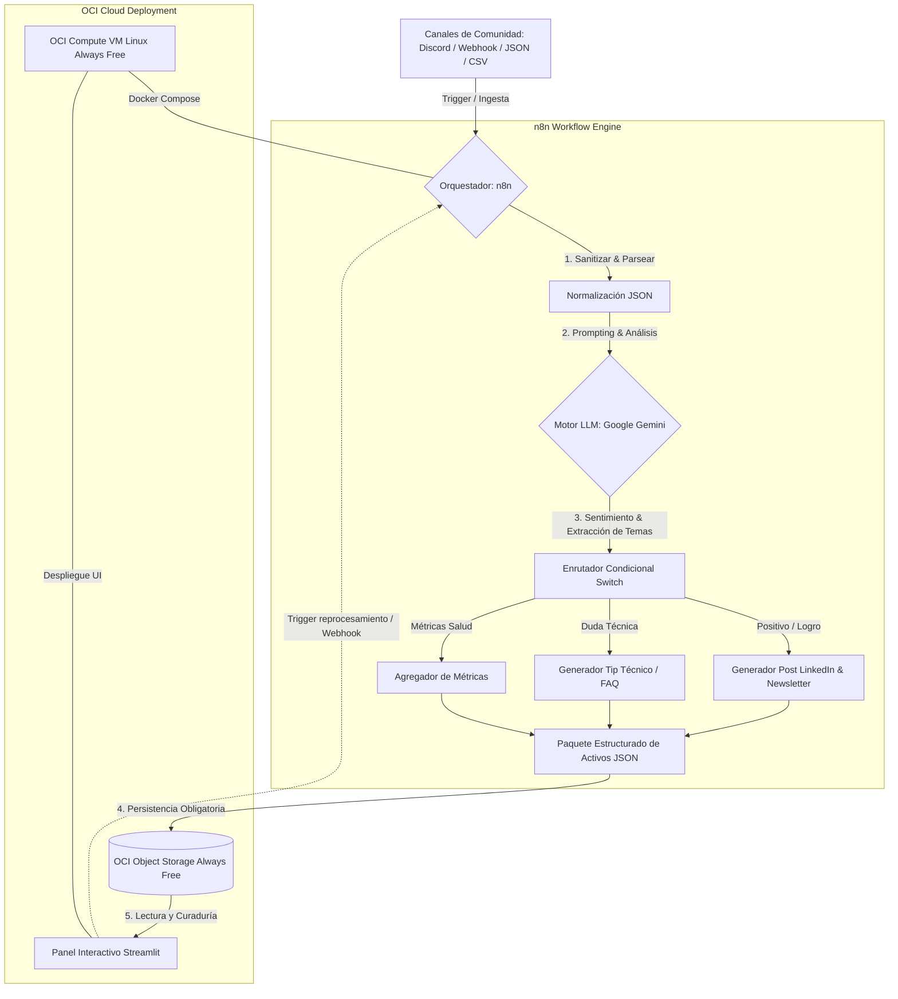

# 🚀 CommunityLab — Motor Inteligente de Transformación y Distribución para Comunidades Digitales

> **Hackathon ONE G10 — Oracle Next Education & Alura / No Country**  
> **Equipo 6 — LATAM**

---

## 📌 Descripción del Proyecto
**CommunityLab** es una plataforma automatizada que ingiere la actividad orgánica de comunidades de aprendizaje y tecnología (chats de Discord, foros, dudas de cursos, testimonios espontáneos) y la transforma mediante Modelos de Lenguaje (LLMs) en **activos de marketing y distribución listos para publicar**:
- 💼 **Publicaciones inspiradoras para LinkedIn & X (Twitter)** a partir de contrataciones y logros de estudiantes.
- 📰 **Resúmenes semanales (Community Highlights)** y secciones destacadas para Newsletters.
- 💡 **Preguntas Frecuentes (FAQs) y Tips Técnicos** detectados automáticamente desde las dudas recurrentes.
- ☁️ **Persistencia en la nube:** almacenamiento seguro y estructurado de los activos en **Oracle Cloud Infrastructure (OCI) Object Storage (Always Free)**.
- 📊 **Panel de Curaduría en Streamlit:** interfaz visual para que el equipo de Community Managers y Marketing apruebe, edite y gestione los copys antes de publicarlos.

---

## 🏗️ Arquitectura de la Solución



---

## 👥 Equipo 6 (Integrantes y Roles)

| Integrante | Ubicación | Rol Principal |
| :--- | :--- | :--- |
| **César Augusto Cely Pulido** | Bogotá, Colombia | **Project Manager & Cloud Architect** |
| **Max Ferrer Cabanillas Salas** | Lima, Perú | **Backend & Pipeline Developer** |
| **Raúl Gallardo** | Buenos Aires, Argentina | **QA & Cloud Support** |
| **José Medina** | Paraguay | **Oracle Ecosystem & N8N / LLMs Specialist** |
| **Juan Luis Mansilla** | Puerto Montt, Chile | **Backend & Fullstack Developer** |
| **Edwin Gustavo Enriquez Arias** | La Paz, Bolivia | **QA Lead, Testing Automation & Backend** |
| **Carol Yesenia Arancay Osorio** | LATAM | **Frontend / UX & Data** |
| **Víctor Araya** | LATAM | **Frontend & Documentación** |
| **Rodrigo Ramírez** | LATAM | **Testing & Soporte** |

---

## 📁 Estructura del Repositorio

```text
├── docker-compose.yml                # Despliegue de n8n (Local & OCI Compute VM)
├── .env.example                      # Plantilla de variables de entorno (Gemini, OCI, n8n)
├── README.md                         # Documentación general y arquitectura
├── PM_Files/                         # Gestión del Proyecto y Metodología Ágil
│   ├── ROADMAP.md                    # Plan maestro de 5 semanas, hitos y demos
│   ├── acta-primera-reunion_14092026.md # Acta de Kickoff
│   └── Proyecto 3 – 🚀 CommunityLab.pdf # Especificación oficial del reto
├── data/
│   └── interacciones_ejemplo.json    # Dataset de prueba con 15 interacciones simuladas
├── n8n/                              # Orquestación de flujos
│   ├── README.md                     # Guía de conexión a la VM OCI y versionado
│   └── workflows/                    # Workflows exportados en JSON para Git
├── src/
│   ├── ingestion/                    # Lectura y parsing de JSON, CSV o Webhooks
│   ├── ai_engine/                    # Prompts, análisis con Gemini y schemas de salida
│   ├── cloud_oci/                    # Conexión y persistencia con OCI Object Storage
│   └── ui/                           # Panel de curaduría interactivo en Streamlit
└── tests/                            # Pruebas unitarias y de integración (QA)
```

---

## ⚙️ Requisitos Previos y Configuración Local

### 1. Clonar el Repositorio
```bash
git clone git@github.com:No-Country-simulation/G10-LATAM-equipo6-CommunityLab.git
cd G10-LATAM-equipo6-CommunityLab
```

### 2. Configurar el Entorno Virtual de Python
```bash
python3 -m venv venv
source venv/bin/activate
pip install -r requirements.txt
```

### 3. Variables de Entorno
Copia el archivo `.env.example` como `.env` y completa tus credenciales de Gemini y OCI:
```bash
cp .env.example .env
```

---

## 📅 Roadmap de Sprints (5 Semanas)
Consulta el cronograma completo y los entregables por sprint en [ROADMAP.md](file:///home/cesar-cely/Proyectos/G10-LATAM-equipo6-CommunityLab/PM_Files/ROADMAP.md).