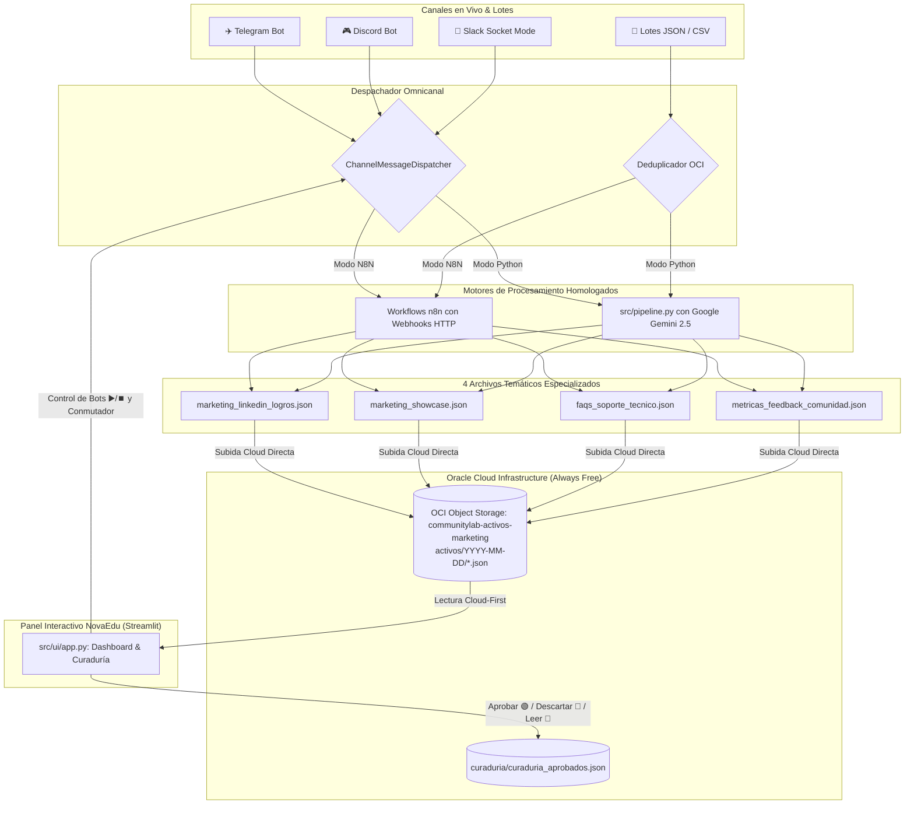

# 🚀 CommunityLab — Motor Inteligente de Transformación y Distribución para Comunidades Digitales

> **Hackathon ONE G10 — Oracle Next Education & Alura / No Country**  
> **Equipo 6 — LATAM**

---

## 📌 Descripción del Proyecto

**CommunityLab** es una plataforma inteligente de escucha activa, transformación y curaduría automatizada de contenido para comunidades técnicas de aprendizaje (como Discord, Telegram, Slack o lotes de datos). 

Extrae valor orgánico generado por estudiantes y lo convierte en activos listos para su distribución:
- 💼 **Publicaciones inspiradoras para LinkedIn & X (Twitter):** Generadas a partir de contrataciones, certificaciones y logros de estudiantes.
- 📰 **Resúmenes semanales (Community Highlights):** Secciones estructuradas para Newsletters.
- 💡 **Preguntas Frecuentes (FAQs) y Tips Técnicos:** Detectados y resueltos automáticamente a partir de dudas recurrentes.
- 🤖 **Bots Omnicanal en Vivo:** Escucha activa bidireccional en tiempo real para **Telegram** (`@G10_Latam_06_bot`), **Discord** (`G10-LATAM-06`) y **Slack** (Socket Mode), con conmutación dinámica entre motor Python puro y n8n.
- ☁️ **Persistencia en la Nube:** Almacenamiento seguro, tipado y deduplicado en **Oracle Cloud Infrastructure (OCI) Object Storage (Tier Always Free)**.
- 🎨 **Panel de Curaduría NovaEdu (Streamlit Modular):** Interfaz rediseñada en componentes desacoplados (`src/ui/components` y `src/ui/views`) con control de seguridad administrativa (`SETTINGS_ADMIN_KEY`), selección de fuentes (OCI vs Local) y panel de edición de copys.

---

## 🏗️ Arquitectura de la Solución (Omnicanal & Dual-Engine Cloud-Native)

CommunityLab cuenta con una **arquitectura omnicanal y dual de orquestación homologada** que permite procesar tanto lotes históricos como mensajes en vivo desde chats comunitarios, convergiendo en **Oracle Cloud Infrastructure (OCI) Object Storage** como única fuente de verdad:


```mermaid
flowchart TD
    subgraph INGESTA_EN_VIVO ["Canales en Vivo & Lotes"]
        TG[✈️ Telegram Bot]
        DC[🎮 Discord Bot]
        SL[💬 Slack Socket Mode]
        BATCH[📁 Lotes JSON / CSV]
    end

    subgraph DISPATCHER ["Despachador Omnicanal"]
        TG & DC & SL --> DISP{ChannelMessageDispatcher}
        BATCH --> DEDUP{Deduplicador OCI}
    end

    subgraph DUAL_ENGINE ["Motores de Procesamiento Homologados"]
        DISP & DEDUP -->|Modo N8N| N8N[Workflows n8n con Webhooks HTTP]
        DISP & DEDUP -->|Modo Python| PY[src/pipeline.py con Google Gemini 2.5]
    end

    subgraph ESPECIALIZACION ["4 Archivos Temáticos Especializados"]
        N8N & PY --> ARCH1[marketing_linkedin_logros.json]
        N8N & PY --> ARCH2[marketing_showcase.json]
        N8N & PY --> ARCH3[faqs_soporte_tecnico.json]
        N8N & PY --> ARCH4[metricas_feedback_comunidad.json]
    end

    subgraph OCI_CLOUD ["Oracle Cloud Infrastructure (Always Free)"]
        ARCH1 & ARCH2 & ARCH3 & ARCH4 -->|Subida Cloud Directa| BUCKET[("OCI Object Storage: communitylab-activos-marketing<br/>activos/YYYY-MM-DD/*.json")]
        CUR_DATA[("curaduria/curaduria_aprobados.json")]
    end

    subgraph STREAMLIT_PANEL ["Panel Interactivo NovaEdu (Streamlit)"]
        BUCKET -->|Lectura Cloud-First| UI[src/ui/app.py: Dashboard & Curaduría]
        UI -->|Aprobar 🟢 / Descartar 🔴 / Leer 🔵| CUR_DATA
        UI -->|Control de Bots ▶️/⏹️ y Conmutador| DISP
    end
```

---

## 👥 Equipo 6 (Integrantes y Roles)

| Integrante | Ubicación | Rol Principal |
| :--- | :--- | :--- |
| **César Augusto Cely Pulido** | Bogotá, Colombia | **Project Manager & Cloud Architect** |
| **Max Ferrer Cabanillas Salas** | Lima, Perú | **Backend & Pipeline Developer** |
| **Raúl Gallardo** | Buenos Aires, Argentina | **QA & Cloud Support** |
| **José Medina** | Paraguay | **Oracle Ecosystem & N8N / LLMs Specialist** |
| **Juan Luis Mansilla** | Puerto Montt, Chile | **Backend & Fullstack Developer** |
| **Edwin Gustavo Enriquez Arias** | La Paz, Bolivia | **QA Lead, Testing Automation & Backend** |
| **Carol Yesenia Arancay Osorio** | Lima, Perú | **Frontend / UX & Data** |
| **Víctor Araya** | LATAM | **Frontend & Documentación** |
| **Rodrigo Ramírez** | LATAM | **Testing & Soporte** |

---

## 📁 Estructura del Repositorio

```text
├── docker-compose.yml                # Despliegue de n8n (Local & OCI Compute VM)
├── .env.example                      # Plantilla sanitizada de variables de entorno (Gemini, OCI, n8n, Bots, Admin Key)
├── config/
│   └── settings.example.json         # Plantilla estructurada de configuración del backend
├── README.md                         # Documentación general y arquitectura
├── backend-pipeline.md               # Guía técnica profunda del Backend y persistencia OCI
├── PM_Files/                         # Gestión del Proyecto y Metodología Ágil
│   ├── ROADMAP.md                    # Plan maestro de 5 semanas, hitos y demos
│   ├── Actas_Reuniones/              # Minutas y actas de reuniones semanales
│   └── Proyecto 3 – 🚀 CommunityLab.pdf # Especificación oficial del reto
├── data/
│   └── interacciones_ejemplo.json    # Dataset oficial con 15 interacciones simuladas
├── logs/                             # Trazas y auditoría de ejecución rotativas diarias
├── n8n/                              # Orquestación de flujos
│   ├── README.md                     # Guía de conexión a la VM OCI y versionado
│   └── workflows/                    # Workflows exportados en JSON para Git
├── src/
│   ├── ai_engine/                    # Modelos Pydantic v2, prompts y cliente Gemini
│   ├── channels/                     # Integración omnicanal en vivo (Telegram, Discord, Slack, BotManager)
│   ├── cloud_oci/                    # Conector con Oracle Cloud Infrastructure Object Storage
│   ├── ingestion/                    # Lectura, validación, batching y deduplicación
│   ├── pipeline.py                   # Pipeline Python E2E y CLI
│   ├── ui/                           # Panel de curaduría NovaEdu modular en Streamlit
│   │   ├── components/               # Componentes reusables (header, sidebar, editor, preview, post_list)
│   │   ├── views/                    # Vistas aisladas (dashboard, curation, ingestion, storage, connections, settings, observability)
│   │   ├── scripts/                  # Adaptadores de datos, servicios UI, estado y estilos
│   │   ├── config_manager.py         # Gestor de doble persistencia (.env + JSON)
│   │   └── app.py                    # Punto de entrada principal de la app Streamlit
│   └── utils/                        # Logging y utilidades transversales
└── tests/                            # Suite automatizada (73/73 pruebas pasando)
```

---

## ⚙️ Requisitos Previos y Configuración Local

### 1. Clonar el Repositorio
```bash
git clone git@github.com:No-Country-simulation/G10-LATAM-equipo6-CommunityLab.git
cd G10-LATAM-equipo6-CommunityLab
```

### 2. Configurar el Entorno Virtual de Python
```bash
python3 -m venv .venv
source .venv/bin/activate
pip install -r requirements.txt
```

### 3. Variables de Entorno
Copia el archivo `.env.example` como `.env` y completa tus credenciales de Gemini, OCI y Bots:
```bash
cp .env.example .env
```

### 4. Ejecución del Panel de Curaduría (Streamlit)
```bash
streamlit run src/ui/app.py
```
Accede a través de tu navegador a `http://localhost:8501`.

Si tienes `AUTOSTART_BOTS=true` en tu `.env`, los bots de Telegram, Discord y Slack arrancarán automáticamente a escuchar en segundo plano al iniciar la app.

### 5. Orquestador n8n
- **En la Nube (Instancia oficial del equipo):** La VM de OCI Always Free corre n8n directamente en [http://147.15.9.116:5678](http://147.15.9.116:5678).
- **En Local:** Ejecuta `docker compose up -d` y accede en `http://localhost:5678`.
- Consulta la guía completa de flujos y versionado en [`n8n/README.md`](n8n/README.md).

### 6. Ejecución de Pruebas Automatizadas & Estrategia de QA
```bash
pytest tests/ -v
```
*Total:* **73 tests unitarios e integrales (100% aprobados)** cubriendo ingesta, validación Pydantic, cliente OCI, bots omnicanal, pipeline y servicios UI.  
*Estrategia QA (Semana Ganada de Ventaja):* Gracias a un desarrollo acelerado, el equipo cuenta con 1 semana de ventaja antes del Demo Day dedicada exclusivamente al aseguramiento de calidad (QA), resiliencia de bots, pruebas de carga en OCI Object Storage y refinamiento continuo de UX/UI.

---

## 📅 Roadmap de Sprints (5 Semanas)
Consulta el cronograma completo y los entregables por sprint en [ROADMAP.md](PM_Files/ROADMAP.md).
