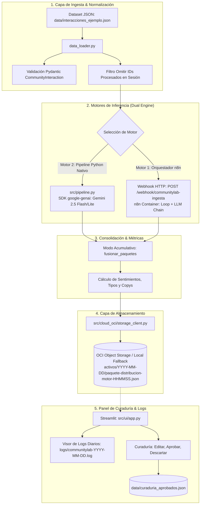

# 🛠️ Guía Técnica del Backend & Pipeline: Arquitectura, Despliegue y Replicación del Entorno

**Proyecto:** CommunityLab — Hackathon ONE G10 (Oracle & Alura / No Country)  
**Equipo:** Equipo 6 - LATAM  
**Destinatarios:** Integrantes del Equipo (Célula Frontend, Célula Cloud, Célula IA & Mentores)  
**Fecha:** 20 de septiembre de 2026  
**Rama Oficial:** `feat/backend-pipeline-max`  
**Estado:** 100% Funcional — 44/44 Tests Unitarios Pasando

---

## 📌 1. Descripción General del Sistema

**CommunityLab** es una plataforma diseñada para ingerir interacciones orgánicas de comunidades de aprendizaje técnico (como Discord o foros de Alura / Oracle ONE), analizarlas mediante modelos de lenguaje avanzados (LLMs) y transformarlas automáticamente en:

1. **Publicaciones para Redes Sociales (LinkedIn y X):** Copys estructurados con ganchos persuasivos, lecciones aprendidas y hashtags relevantes.
2. **Contenido Educativo y FAQs Dinámicas:** Tips técnicos paso a paso para resolver dudas recurrentes de los estudiantes.
3. **Persistencia en la Nube:** Almacenamiento seguro en **Oracle Cloud Infrastructure (OCI) Object Storage** en la capa Always Free.
4. **Panel de Curaduría Humana:** Interfaz interactiva donde los Community Managers pueden filtrar, editar, aprobar o descartar publicaciones.

---

## 🏗️ 2. Arquitectura del Pipeline

El sistema cuenta con una **arquitectura dual de orquestación** que permite ejecutar y contrastar dos motores diferentes:



---

## 📁 3. Estructura de Módulos del Backend

```text
├── data/                                 # Datasets y almacenamiento local
│   ├── interacciones_ejemplo.json        # Dataset oficial con 15 casos de prueba
│   ├── curaduria_aprobados.json          # Registro de decisiones de los Community Managers
│   └── oci_local_storage/                # Modo fallback de OCI (emulación local offline)
│       └── activos/YYYY-MM-DD/           # Paquetes JSON persistidos por fecha y motor
├── logs/                                 # Directorio de logs rotativos diarios
│   └── communitylab-YYYY-MM-DD.log       # Archivo de auditoría generado por fecha
├── n8n/workflows/                        # Workflows de n8n
│   ├── communitylab_ingesta_local_webhook.json # Flujo adaptado con Webhook HTTP
│   ├── communitylab_ingesta_llm.json     # Flujo original del equipo (intacto)
│   ├── jmedinag_WF_002.json              # Flujo de José Medina (intacto)
│   └── ingestion_groq_subflow.json       # Subflujo de Groq (intacto)
├── src/                                  # Código fuente principal
│   ├── ai_engine/                        # Modelos Pydantic e inferencia con Gemini
│   │   ├── schemas.py                    # Modelos de datos tipados (Pydantic V2)
│   │   ├── gemini_service.py             # Cliente oficial google-genai con fallback y backoff
│   │   ├── prompt_templates.json         # Plantillas de System Prompt y User Prompt
│   │   └── validator.py                  # Utilidades de limpieza de JSON/Markdown
│   ├── cloud_oci/                        # Conector con Oracle Cloud Infrastructure
│   │   └── storage_client.py             # OCIStorageManager (Cloud + Local Fallback)
│   ├── ingestion/                        # Carga, batching y deduplicación
│   │   └── data_loader.py                # Lectura, validación y filtros de exclusión
│   ├── pipeline.py                       # Orquestador E2E y soporte para CLI
│   ├── utils/                            # Utilidades compartidas
│   │   └── logger.py                     # Logger rotativo diario (thread-safe)
│   └── ui/                               # Capa de presentación y servicios
│       ├── services.py                   # Lógica de negocio desacoplada de la UI
│       └── app.py                        # Panel de Curaduría y Orquestador en Streamlit
└── tests/                                # Suite completa de 44 pruebas unitarias
    ├── test_ai_engine.py                 # Validación de esquemas Pydantic
    ├── test_cloud_oci.py                 # Pruebas del gestor de OCI
    ├── test_gemini_service.py            # Pruebas de inferencia y resiliencia
    ├── test_ingestion.py                 # Pruebas de ingesta y deduplicación
    ├── test_pipeline.py                  # Pruebas de ejecución E2E
    └── test_ui_services.py               # Pruebas de acumulación, logs y n8n
```

---

## 💻 4. Guía Paso a Paso para Replicar el Entorno Local

Para Replicar en el Entorno Local seguir estos pasos:

### Paso 1: Clonar el Repositorio y Situarse en la Rama

```bash
git clone git@github.com:No-Country-simulation/G10-LATAM-equipo6-CommunityLab.git
cd G10-LATAM-equipo6-CommunityLab
git checkout feat/backend-pipeline-max
```

### Paso 2: Crear y Activar el Entorno Virtual (Python 3.11)

```bash
# Crear entorno virtual
python -m venv venv

# Activar en Windows (PowerShell):
.\venv\Scripts\Activate.ps1
# Activar en Linux o macOS:
source venv/bin/activate
```

### Paso 3: Instalar Dependencias Oficiales

```bash
pip install --upgrade pip
pip install -r requirements.txt
```

### Paso 4: Configurar Variables de Entorno (`.env`)

Copia la plantilla de ejemplo y añade tus credenciales:

```bash
cp .env.example .env
```

Edita el archivo `.env` con los siguientes parámetros clave:

```ini
# API Key de Google Gemini (Gratis en https://aistudio.google.com/)
GEMINI_API_KEY=AIzaSy...

# Logging detallado diario
ENABLE_DETAILED_LOG=true
LOG_FILE_PATH=logs/communitylab.log
LOG_LEVEL=INFO

# Orquestador n8n Local
N8N_LOCAL_WEBHOOK_URL=http://localhost:5678/webhook/communitylab-ingesta

# OCI Object Storage (Si no se configuran, opera automáticamente en modo local fallback)
OCI_USER_OCID=
OCI_TENANCY_OCID=
OCI_KEY_FILE=
OCI_FINGERPRINT=
OCI_REGION=us-ashburn-1
OCI_NAMESPACE=
OCI_BUCKET_NAME=communitylab-assets
```

---

## 🧪 5. Validación del Sistema y Pruebas

### 5.1 Ejecutar Suite de Pruebas Automatizadas

Para confirmar que todos los módulos están 100% operativos:

```bash
pytest
```

**Resultado esperado:**

```text
============================= 44 passed in 1.06s ==============================
```

### 5.2 Ejecución por Línea de Comandos (CLI)

Puedes correr el pipeline E2E directamente en la terminal sin necesidad de interfaz gráfica:

```bash
python -m src.pipeline --input data/interacciones_ejemplo.json --limit 3
```

---

## 🌐 6. Ejecución del Panel Visual en Streamlit

Para abrir la interfaz de curaduría y orquestación:

```bash
streamlit run src/ui/app.py
```

Abre tu navegador en: **`http://localhost:8501`**.

### Vistas Disponibles en la Interfaz:

1. **💼 Curaduría de Activos:**
   - Visualiza métricas en tiempo real.
   - Los posts aparecen ordenados con los más recientes al principio (`⏱️ Mostrar más recientes primero`).
   - Permite editar el copy para LinkedIn o el tip técnico y pulsar **Aprobar** o **Rechazar**.
2. **⚡ Ejecutar Pipeline:**
   - **Fila 1:** `Límite de registros` | `Filtrar por canal` | `[🗑️ Vaciar Lotes Locales]` | `[⚠️ Vaciar Histórico OCI ⌄]`.
   - **Fila 2:** `[☑️ Subir a OCI Storage]` | `[☑️ Acumular con previos]` | `[☑️ Omitir ya procesados]`.
   - Selector de motor para ejecutar con **Python Nativo** o con **n8n**.
   - Visor de logs en vivo en la parte inferior con botones de refresco y limpieza.
3. **☁️ Histórico OCI Object Storage:**
   - Explora todos los paquetes persistidos en el almacenamiento y permite su vaciado seguro con confirmación previa.

---

## 🐳 7. Levantar el Orquestador n8n Local con Docker

Probar la ejecución contra el motor de n8n:

1. **Levantar el contenedor:**
   ```bash
   docker compose up -d
   ```
2. **Acceder a n8n:**  
   Abre [http://localhost:5678](http://localhost:5678) en el navegador.
3. **Importar el Flujo Adaptado:**
   - En el menú lateral de n8n, selecciona **Workflows** -> **Import from file**.
   - Elige el archivo: `n8n/workflows/communitylab_ingesta_local_webhook.json`.
4. **Configurar Credenciales:**
   - Asigna tu clave de Groq o Gemini en las credenciales del nodo de IA.
5. **Activar el Flujo:**
   - En la esquina superior derecha, activa el interruptor a **Active (Verde)**.
6. **Ejecutar desde Streamlit:**
   - En la pestaña **⚡ Ejecutar Pipeline**, presiona el botón **`🌐 Ejecutar con Orquestador n8n`**.

---

## 📊 8. Comparativa Técnica de Motores

| Característica            | 🐍 Motor Python Nativo                        | 🔄 Orquestador n8n Local           |
| :------------------------ | :-------------------------------------------- | :--------------------------------- |
| **Entorno de Ejecución**  | Proceso nativo Python / CLI / Streamlit       | Contenedor Docker en puerto 5678   |
| **Modelo de IA**          | Google Gemini 2.5 Flash (Fallback a 2.5 Lite) | Groq (Llama 3 / Mixtral) o Gemini  |
| **Tiempo de Respuesta**   | Ultrarrápido (~2 a 4 segundos por lote)       | Secuencial con pausas de seguridad |
| **Validación de Esquema** | Pydantic V2 estricto en código                | Structured Output Parser           |
| **Identificador de Lote** | `[py_HHMMSS]`                                 | `[n8n_HHMMSS]`                     |
| **Sufijo en OCI**         | `paquete-distribucion-python-*.json`          | `paquete-distribucion-n8n-*.json`  |

---

## 🤝 9. Contratos de Integración para Otras Células

- **Para la Célula Frontend (React / Next.js):**
  Los datos se exportan bajo el esquema JSON estandarizado visible en `data/paquete_procesado.json`. La lógica contenida en `src/pipeline.py` puede envolverse fácilmente en endpoints REST con **FastAPI** si el equipo desea desacoplar Streamlit.
- **Para la Célula Cloud (OCI & DevOps):**
  El módulo `storage_client.py` utiliza el SDK estándar de Oracle Cloud. Una vez configuradas las variables de entorno en la VM de producción, el pipeline comenzará a enviar los datos al Bucket real sin requerir cambios de código.
